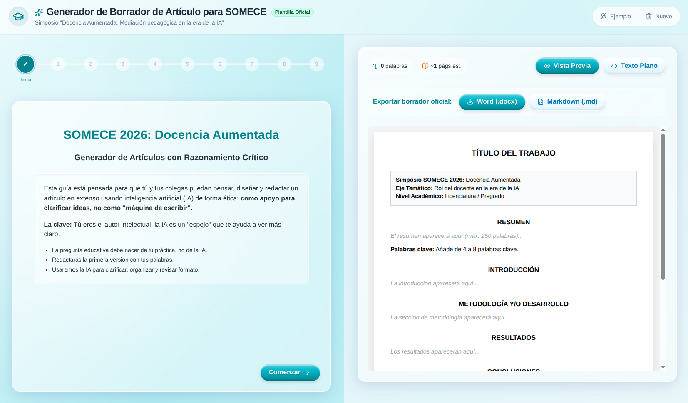
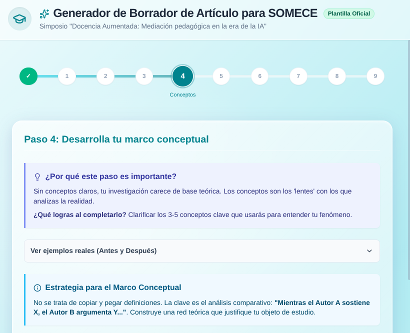
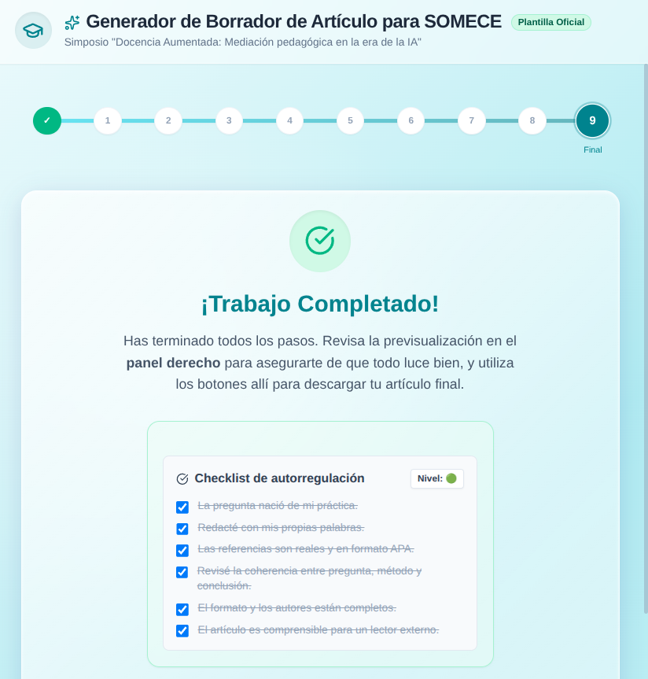

# SOMECE Draft Generator
Historical archive and supplementary documentation of the instructional design of the **SOMECE Draft Generator**: a reflective AI writing tool.

**Project page:** https://horurasu.github.io/somece-draft-generator/

> **Availability note:** The SOMECE Draft Generator web application is no longer active or publicly available
> (the address cited in the article, `appdemo.pod3.site`, is no longer in service).
> This repository serves solely as a historical archive of the instructional design analyzed in the article,
> preserving the screenshots and reference materials so readers can inspect the artifact's architecture.

## About

The Draft Generator is an instructional design artifact that frames generative AI as a *mirror* rather than a *typewriter*.
It does not embed a language model or generate the intellectual content of the article; instead, it structures the
author–AI relationship to preserve authorship, judgment, and critical thinking in academic writing through:

- A nine-step reflective itinerary
- Mandatory prior writing before AI prompting
- Feedback-oriented prompt generation (not substitution)
- A self-regulation checklist with a visual level indicator

In use: the author writes first → the tool composes a feedback-oriented prompt → the author takes it to an AI platform
of their choice → what comes back is treated as a draft to be reworked. The full analysis is in the article.

## Article

**AI as a Mirror: Designing for Judgment and Authorship in Academic Writing**

- Martín Joaquín Aguilar Muñoz1
- Christian Jonathan Angel Rueda2
- Ricardo Rivera Carrillo1

1 Universidad Marista de Querétaro, Querétaro, México 
2 Universidad Politécnica de Santa Rosa Jáuregui, Querétaro, México

- **Preprint (Jxiv):** *Coming soon — link will be added after publication*
- **Keywords:** generative artificial intelligence, academic writing, AI mirror, cognitive offloading, instructional design

## Screenshots

### Figure 1 – Home Screen
Establishes the tool's "epistemic contract": AI supports the clarification of ideas; it is not a typewriter that replaces the author's judgment.

### Figure 2 – Nine-Step Process
Writing is broken into sequential phases that require the author's own prior production before any feedback prompt is generated.

### Figure 3 – Self-Regulation Checklist
A metacognitive device that asks users to evaluate their own work before moving on.

## Citation

*Coming soon.* Citation details will be added once the preprint is published.

## License

This project documentation is shared for academic and educational purposes.
